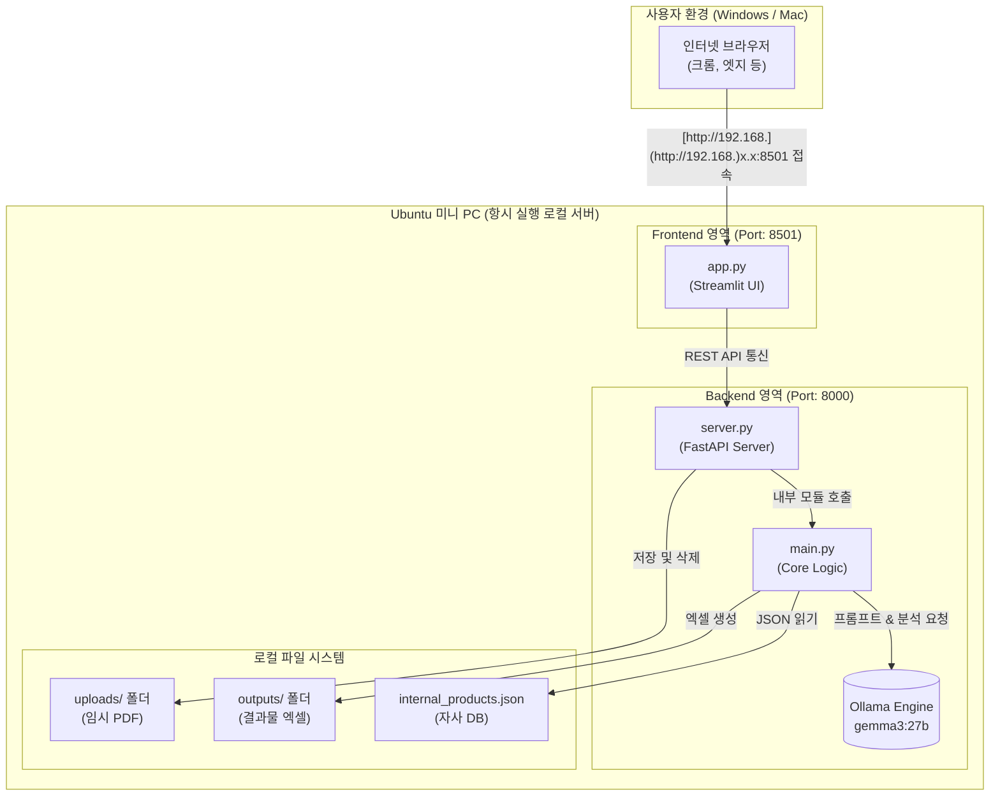

# network_ollama_ai (ollama ai를 활용한 규격서 자동분석 프로그램)


공공기관 및 기업의 **물품규격서/제안요청서(RFP) PDF를 분석하여, 자동으로 제품을 매칭하고 단가와 총액이 포함된 견적용 엑셀(Excel)을 생성**해 주는 온프레미스(On-Premise) AI 시스템입니다.

기업의 보안 유지를 위해 외부 클라우드 API를 사용하지 않고, **Ollama 기반의 로컬 LLM**을 활용하여 사내 미니 PC(Ubuntu) 서버에서 단독으로 구동되도록 설계되었습니다.

---

## ✨ 주요 기능 (Key Features)

* **📄 PDF 규격서 자동 파싱:** 복잡한 제안요청서 내에서 필요한 요구사항과 규격 정보만 스마트하게 추출합니다.
* **🏢 자사 DB 최우선 매칭 (RAG 기반):** 사전에 학습된 내부 제품 리스트(`internal_products.json`)와 대조하여, 자사 취급 품목을 최우선으로 견적에 반영합니다.
* **🧠 AI 기반 제조사/모델명 역추적:** 내부 DB에 없는 제품의 경우, AI가 스펙을 분석하여 원본 제조사와 모델명을 역추적(Deduction)합니다.
* **💰 지능형 단가 추정 및 환율 계산:** AI 모델의 영어 학습 데이터를 고려하여 **USD($) 기준 시장가(MSRP)를 먼저 추정**한 뒤, 설정된 환율을 적용하여 **KRW(₩) 단가 및 총액을 자동 계산**합니다.
* **📊 스마트 엑셀 다운로드:** 추출된 데이터(수량, 단가, 총액)를 엑셀 형식으로 즉시 제공하며, **제조사 공식 홈페이지 또는 네이버 스마트 쇼핑 검색 링크**를 자동으로 생성하여 더블체크를 돕습니다.

---

## 🏗️ 시스템 아키텍처 (Architecture)

본 프로젝트는 사내망에서 누구나 접속하여 사용할 수 있도록 **클라이언트-서버 모델**로 구축되었습니다.

- **Backend (Server):** `FastAPI` + `Uvicorn` (비동기 API 제공 및 AI 로직 처리)
- **Frontend (Client):** `Streamlit` (사용자 친화적인 Web UI 제공)
- **AI Engine:** `Ollama` (gemma3:27b 등 로컬 LLM 구동)
- **Infra:** 24시간 상시 가동되는 사내 전용 Ubuntu 미니 PC 서버


> 
> 

---

## 🛠️ 기술 스택 (Tech Stack)

* **Language:** Python 3.x
* **Web Framework:** FastAPI, Streamlit
* **AI / LLM:** Ollama (Local LLM Engine), Gemma3 / Llama3.1
* **Data Processing:** Pandas, pdfplumber, openpyxl
* **OS / Environment:** Ubuntu 24.04 LTS (Server), Windows/macOS (Client)

---

## 🚀 설치 및 실행 방법 (Installation)

### 1. 필수 환경 구성 (Ubuntu Server 기준)
먼저 시스템에 Python 3와 [Ollama](https://ollama.com/)가 설치되어 있어야 합니다.
```bash
# Ollama 설치
curl -fsSL [https://ollama.com/install.sh](https://ollama.com/install.sh) | sh

# AI 모델 다운로드 (예: gemma3:27b)
ollama run gemma3:27b
```

## 📂 디렉토리 구조 (Folder Structure)

```bash
📦 network_ollama_ai
 ┣ 📜 app.py                   # Streamlit 프론트엔드 UI
 ┣ 📜 server.py                # FastAPI 백엔드 서버
 ┣ 📜 main.py                  # 핵심 AI 프롬프트 및 데이터 처리 로직
 ┣ 📜 internal_products.json   # 자사/협력사 제품 DB (사전 학습용)
 ┣ 📂 uploads/                 # 업로드된 PDF 임시 저장소
 ┗ 📂 outputs/                 # 생성된 결과물(Excel) 저장소
 ```

## 🏗️ 시스템 아키텍처 (Architecture)

본 프로젝트는 사내망에서 누구나 접속하여 사용할 수 있도록 **클라이언트-서버 모델**로 구축되었습니다.

### 1. 시스템 컴포넌트 구조도


sequenceDiagram
    actor User as 사용자 (Windows)
    participant UI as app.py (Streamlit)
    participant API as server.py (FastAPI)
    participant Core as main.py (로직)
    participant Ollama as Ollama (AI)
    participant FileSys as 파일 시스템

    User->>UI: 브라우저 접속
    UI->>API: GET /health & /api/internal-db/status
    API->>FileSys: internal_products.json 로드
    FileSys-->>API: DB 내용
    API-->>UI: 연결 상태 및 DB 데이터 응답
    UI-->>User: 메인 화면 표시

    User->>UI: PDF 업로드 및 '분석 시작' 클릭
    UI->>API: POST /api/process-pdf (파일 전송)
    
    API->>FileSys: uploads/ 폴더에 PDF 임시 저장
    API->>Core: process_pdf(pdf_path, model) 호출
    
    Core->>Core: pdfplumber로 PDF 텍스트 추출
    Core->>Ollama: 텍스트 + DB 데이터 + 프롬프트 전송
    Note over Core,Ollama: AI가 달러(USD) 추정 후 원화(KRW) 환산
    Ollama-->>Core: 분석 결과 응답 (JSON 스트링)
    Core->>Core: 데이터 정제 및 파싱
    Core-->>API: items (딕셔너리 리스트) 반환

    API->>Core: save_to_excel(items) 호출
    Core->>FileSys: outputs/ 폴더에 엑셀(.xlsx) 파일 생성
    API->>FileSys: uploads/ 임시 PDF 파일 삭제 (보안 유지)
    
    API-->>UI: 추출된 표 데이터 및 엑셀 다운로드 URL 반환
    UI-->>User: 화면에 결과 표 출력 및 '엑셀 다운로드' 버튼 활성화

    User->>UI: 다운로드 링크 클릭
    UI->>API: GET /api/download/{filename}
    API->>FileSys: 엑셀 파일 로드
    FileSys-->>API: 엑셀 파일
    API-->>User: 파일 다운로드 완료
